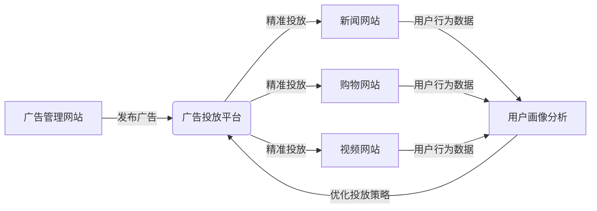

# 广告精准投放生态系统项目

## 📋 项目概述
这是一个包含四个独立网站的广告精准投放生态系统，实现跨站用户追踪和匿名精准广告投放。

## 👥 团队成员分工

| 成员姓名 | 负责模块 | 主要职责 | 技术任务 |
|---------|---------|---------|---------|
| **杜一帆** | **广告管理网站** | 广告发布与管理平台 | - 广告商登录和管理界面<br>- 广告发布API接口设计<br>- 广告类型管理（文字/图片/视频）<br>- 精准投放逻辑实现 |
| **朱紫月** | **新闻网站** | 新闻内容展示平台 | - 新闻内容展示和分类<br>- 文字/图片广告位管理<br>- 用户浏览行为跟踪<br>- 跨站cookie跟踪实现<br>- 广告展示和点击统计 |
| **韩晴** | **购物网站** | 电商购物平台 | - 商品展示和购物功能<br>- 广告与商品分类关联<br>- 用户购物行为分析<br>- 精准广告匹配算法<br>- 交易和广告数据整合 |
| **刘宇晴** | **视频发布分享网站** | 视频内容平台 | - 视频上传和播放功能<br>- 视频中插播广告实现<br>- 视频内容分类管理<br>- 广告视频流控制<br>- 播放行为数据收集 |

## 🏗️ 系统架构



## 🔧 技术栈
- **前端框架**: Vue 3 / React（根据各网站选择）
- **后端技术**: Java + Spring Boot / Node.js
- **数据库**: MySQL / MongoDB
- **服务器**: Tomcat / Nginx
- **开发工具**: IntelliJ IDEA, Git, GitHub
- **版本控制**: Git + GitHub（确保版本统一）
- **部署环境**: 四个独立的服务器

## 📊 开发里程碑

| 阶段 | 时间 | 主要任务 | 负责人 |
|------|------|---------|--------|
| 环境搭建 | 第1周 | 统一开发环境，创建GitHub仓库 | 全体成员 |
| 核心功能开发 | 第2-4周 | 各网站基础功能实现 | 各模块负责人 |
| 广告投放集成 | 第5周 | 跨站跟踪和精准投放逻辑 | 杜一帆 |
| 测试优化 | 第6周 | 功能测试和性能优化 | 全体成员 |
| 部署上线 | 第7周 | 服务器部署和演示准备 | 全体成员 |


# 广告管理系统后端

## 项目概述

广告管理系统是一个基于 Spring Boot 的后端应用程序，用于管理广告的创建、投放、查询等功能。系统支持文本、图片、视频等多种广告类型，并提供用户认证、文件上传、分页查询等核心功能。

## 技术栈

- **后端框架**: Spring Boot 2.x
- **持久层**: MyBatis
- **数据库**: MySQL
- **构建工具**: Maven
- **Java版本**: 8+

## 项目结构

```
com.advertisement_sys
├── common                 # 公共组件
│   ├── PageParam.java     # 分页参数基类
│   ├── PageResult.java    # 分页结果封装
│   ├── Result.java        # 统一响应结果
│   └── ResultCode.java    # 响应状态码枚举
├── config                 # 配置类
│   └── WebMvcConfig.java  # Web MVC配置
├── controller             # 控制器层
│   ├── AdvertisementController.java  # 广告控制器
│   ├── FileUploadController.java     # 文件上传控制器
│   └── UserController.java           # 用户控制器
├── dao                    # 数据访问层
│   ├── AdvertisementMapper.java      # 广告Mapper
│   └── UserMapper.java               # 用户Mapper
├── entity                 # 实体类
│   ├── Advertisement.java            # 广告实体
│   └── User.java                     # 用户实体
├── model                 # 模型类
│   ├── AdvertisementModel.java       # 广告返回模型
│   ├── BeanUtils.java               # Bean转换工具
│   └── LoginResult.java             # 登录结果模型
├── param                 # 参数类
│   ├── AdvertisementParam.java       # 广告参数
│   ├── AdvertisementQueryParam.java  # 广告查询参数
│   └── LoginParam.java              # 登录参数
└── service              # 服务层
    ├── AdvertisementService.java     # 广告服务接口
    └── UserService.java              # 用户服务接口
```

## 核心功能模块

### 1. 广告管理模块
- **广告查询**: 支持分页查询、条件筛选（ID、标题、类型、投放类型等）
- **广告操作**: 新增、更新、删除广告
- **广告投放**: 投放状态管理，查询最新投放广告

### 2. 用户认证模块
- **用户登录**: 用户名密码认证
- **跨域支持**: 配置了跨域资源共享（CORS）

### 3. 文件上传模块
- **文件类型**: 支持图片（jpg, png, gif等）和视频（mp4, avi, mov等）
- **文件大小**: 图片最大10MB，视频最大100MB
- **文件组织**: 按日期和类型自动分类存储

### 4. 通用功能模块
- **统一响应格式**: 使用`Result`类封装所有API响应
- **分页支持**: 标准分页参数和结果封装
- **错误处理**: 统一异常处理和状态码管理

## API接口文档

### 广告管理接口
- `POST /api/advertisement/list` - 分页查询广告
- `GET /api/advertisement/{id}` - 根据ID查询广告
- `POST /api/advertisement/save` - 保存广告（新增/更新）
- `POST /api/advertisement/putAds/{id}` - 投放广告
- `GET /api/advertisement/queryLastAds` - 查询最新广告

### 用户接口
- `POST /api/user/login` - 用户登录

### 文件上传接口
- `POST /api/upload/file` - 上传文件（自动识别图片/视频）

## 实体设计

### 广告实体（Advertisement）
```java
{
  "id": "BigInteger",           // 广告ID
  "title": "String",            // 广告标题
  "advertisementType": "String", // 广告类型（text/video/picture）
  "putType": "String",          // 投放类型（mobile/clothes/photography/computer）
  "putFlag": "Boolean",         // 是否投放
  "content": "String",          // 广告内容（文本内容或文件URL）
  "createTime": "Date"          // 创建时间
}
```

### 用户实体（User）
```java
{
  "id": "BigInteger",           // 用户ID
  "username": "String",         // 用户名
  "password": "String",         // 密码
  "status": "Integer",          // 状态（0-禁用，1-启用）
  "createTime": "Date",         // 创建时间
  "updateTime": "Date"          // 更新时间
}
```

# 广告管理网站前端项目

## 项目概述

这是一个基于 Vue 3 的广告管理网站前端系统，提供广告的创建、查看、投放和管理功能。系统包含用户认证、广告列表展示、文件上传等核心功能，采用现代化的UI设计。

## 技术栈

- **前端框架**: Vue 3 + Composition API
- **路由管理**: Vue Router
- **HTTP客户端**: Axios
- **样式**: 原生CSS + Flexbox/Grid布局
- **构建工具**: Vite 

## 项目结构

```
src/
├── components/
│   ├── AdsList.vue          # 广告列表主组件
│   ├── Login.vue            # 登录页面
│   ├── MainLayout.vue       # 主布局组件
│   ├── MainPage.vue         # 主页面容器
│   ├── common/
│   │   ├── Modal.vue        # 通用模态框组件
│   │   ├── Sidebar.vue      # 侧边栏导航
│   │   └── Topbar.vue       # 顶部导航栏
├── router/
│   └── routes.js           # 路由配置
├── api/
│   └── api.js              # API接口封装
├── utils/
│   ├── http.js             # HTTP客户端封装
│   └── date.js             # 日期格式化工具
├── App.vue                 # 根组件
├── main.js                 # 应用入口
└── style.css              # 全局样式
```

## 功能特性

### 1. 用户认证
- 登录页面：用户名/密码验证
- 路由守卫：保护需要认证的路由
- 本地存储：保持用户会话状态
- 登出功能

### 2. 广告管理
- **广告列表**：
  - 分页显示广告记录
  - 按广告类型、投放类型筛选展示
  - 投放状态切换
  - 表格响应式布局

- **创建广告**：
  - 支持文本、图片、视频三种广告类型
  - 动态表单验证
  - 图片/视频文件上传（带预览）
  - 文件类型和大小验证
  - 投放类型选择（手机、服装、摄影、笔记本）

### 3. 文件上传
- 图片上传：支持常见图片格式，最大10MB
- 视频上传：支持常见视频格式，最大100MB
- 实时预览功能
- 上传进度反馈

### 4. 响应式设计
- 桌面端优化布局
- 移动端适配
- 现代化UI组件
- 优雅的交互动效

## 核心组件说明

### AdsList.vue
主广告管理组件，包含：
- 广告数据获取和分页
- 新建广告表单（根据类型动态切换）
- 文件上传处理
- 投放操作
- 错误处理和用户反馈

### Modal.vue
可复用模态框组件：
- 支持标题、内容插槽
- 确定/取消操作
- 加载状态指示
- 动画过渡效果

### Sidebar.vue
侧边导航栏：
- 可折叠的菜单项
- 路由状态高亮
- 响应式设计（移动端隐藏）

### Topbar.vue
顶部导航栏：
- 显示当前用户
- 登出功能
- 品牌标识

## API接口封装

### HTTP客户端 (http.js)
- 统一错误处理
- 请求/响应拦截器
- FormData自动处理
- 超时和重试配置

### API模块 (api.js)
封装的接口包括：
- `userApi.login()` - 用户登录
- `adsApi.list()` - 获取广告列表
- `adsApi.save()` - 创建/保存广告
- `adsApi.putAds()` - 投放广告
- `uploadApi.upload()` - 文件上传

## 路由配置

### 路由规则
- `/` → 重定向到登录页
- `/login` → 登录页面
- `/main` → 主管理页面（需要认证）

### 路由守卫
- 访问需要认证的页面时检查本地存储
- 已登录用户访问登录页时重定向到主页面


### 功能流程
1. **登录**：输入用户名密码登录系统
2. **查看广告列表**：进入主页面查看所有广告
3. **创建广告**：
   - 点击"新建"按钮
   - 选择广告类型（文本/图片/视频）
   - 填写必要信息
   - 上传对应文件（图片或视频）
   - 保存广告
4. **投放广告**：在列表中对已创建的广告进行投放操作
5. **登出**：点击顶部导航栏的登出按钮

